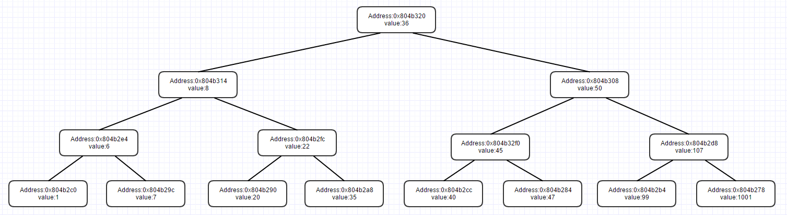

# phase_1  
```c
//Equivalent C Code:
void phase_1(char* s) {
    char *answer = 0x80497c0;//"Public speaking is very easy."
    if (strings_not_equal(s, answer))
        explode_bomb();
}
```
Use gbd to print string locating at 0x8049c0, get the answer:  
Public speaking is very easy.

# phase_2
```c
//Equivalent C Code:
void phase_2(char* s) {
    int arr[6];
    int i, product = 1;
    read_six_numbers(s, arr);//format for read_six_numbers() is "%d %d %d %d %d %d %d"
    for (i = 0; i <= 5; ++i) {
        product *= i + 1;
        if (arr[i] != product) 
            explode_bomb();
    }
}
```
Answer should be:   
1 2 6 24 120 720

# phase_3
```c
//Equivalent C Code:
void phase_3(char* s) {
    char* format = 0x8047de;//"%d %c %d"
    int d1,d2,match;
    char c;
    
    match = sscanf(s, format, &d1, &c, &d2);
    if (match <= 2) 
        explode_bomb();
    switch(d1) {
    case 0:
        if (c != 'q' || d2 != 777) 
            explode_bomb();
        break;
    case 1:
        if (c != 'b' || d2 != 214) 
            explode_bomb();
        break;
    case 2:
        if (c != 'b' || d2 != 755) 
            explode_bomb();
        break;
    case 3:
        if (c != 'k' || d2 != 251) 
            explode_bomb();
        break;
    case 4:
        if (c != 'o' || d2 != 160) 
            explode_bomb();
        break;
    case 5:
        if (c != 't' || d2 != 458) 
            explode_bomb();
        break;
    case 6:
        if (c != 'v' || d2 != 780) 
            explode_bomb();
        break;
    case 7:
        if (c != 'b' || d2 != 524) 
            explode_bomb();
        break;
    default:
        explode_bomb();
    }
}
```
This func uses switch and jump table locates at 0x80497e8, it has 7 answers in total:  
0 q 777  
1 b 214  
2 b 755  
3 k 251  
4 o 160  
5 t 458  
6 v 780  
7 b 524  

# phase_4
```c
//Equivalent C Code:
void phase_4(char* s) {
    char* format = 0x8049808;//"%d"
    int d;
    
    match = sscanf(s, format, &d);
    if (match != 1 || d <= 0) 
        explode_bomb();
    if (55 != func(d))
        explode_bomb();
}

int func4(int x) {
    if (x <= 1) 
        return 1;
    else
        return func4(x -1) + func4(x -2);
}
```
func4 computes Fibonacci and answer will be 9.  

 0 | 1 | 2 | 3 | 4 | 5 | 6 | 7 | 8 | 9 | ... 
 --- | --- | --- | --- | --- | --- | --- | --- | --- | --- | ---   
 1 | 1 | 2 | 3 | 5 | 8 | 13 | 21 | 34| 55 | ...  


# phase_5
```c
//Equivalent C Code:
void phase_5(char* s) {
    int i, offset;
    char *dict = 0x804b220;
    char *answer = 0x804980b;//"giants"
    
    if (6 != string_length(s))
        explode_bomb();
    for (i = 0; i <= 5; ++i) {
        offset = s[i] & 0xf;
        s[i] = dict[offset];
    }
    if (strings_not_equal(s, answer))
        explode_bomb();
}
```
This function translates input string using a dict and requires result to be "giants". Use gdb to get the content of dict:   

Address | Content
--- | ---
0x804b22c | u t f g
0x804b228 | o b p n
0x804b224 | e a w h
0x804b220 | i s r v   

So the offset should be:   

 lettet | g | i | a | n | t | s
 --- | --- | --- | --- | --- | --- | ---
 offset | 15 | 0 | 5 | 11 | 13 | 1
Notice that offset is the lowest 4 bits of input char, so there are multiple answers,  such as:  
?05;=1

# phase_6
```c
//Equivalent C Code:
/*
struct node{
    int val;
    int unused;
    node *next;
}*/
void phase_6(char* s) {
    int arr[6];
    int i, j;
    node *buff[6];
    node *cur;
    
    read_six_numbers(s, arr);
    for (i = 0; i <= 5; ++i) {
        if ((unsigned)(arr[i] - 1) > 5)//arr[i] = 0 will explode
            explode_bomb();
        for (j = i + 1; j <= 5; ++j)
            if (arr[i] == arr[j])
                explode_bomb();
    }
    
    for (i = 0; i <= 5; ++i) {
        cur = 0x804b26c;
        for (j = 1; j < arr[i]; ++j)
            cur = cur->next;
        buff[i] = cur;
    }
    
    for (i = 1; i <= 5; ++i) 
        buff[i - 1]->next = buff[i];
    buff[i] = NULL;
    
    cur = buff[0];
    for (i = 0; i <= 4; ++i) {
        if (cur->val < cur->next->val)
            explode_bomb();
        cur = cur->next;
    }
}
```
This function requires an input of six numbers which should be from 1 to 6 and not duplicated.  
What it does is that given number n refers to nth node in a linked list locating at 0x804b26c and then this func will rearrange the linked list with the order given by input.  
After that, it will check val field in every node to see make sure new list is sorted by descending order.  
Use gdb to print the original linked list:  

Address | 0x804b26c | 0x804b260 | 0x804b254 | 0x804b248 | 0x804b23c | 0x804b230
--- | --- | --- | --- | --- | --- | --- 
index | 1 -> | 2 -> | 3 -> | 4 -> | 5 -> | 6
value | 253 | 725 | 301 | 997 | 212 | 432   

To get a desending order, answer should be:  
4 2 6 3 1 5

# secret_phase
##### Find secret_phase  
By searching secret_phase, we find it's called in phase_defused  
```c
//Equivalent C Code:
void phase_defused() {
    int match, d;
    char *keyword;
    int defused = *((int *)0x804b480);//count of defused phase
    char *fomat = 0x8049d03//"%d %s"
    char *s = 0x804b770//where answer of phase_4 locates
    char *answer = 0x8049d09//Answer for keyword is "austinpowers"
    
    if (6 == defused) {
        match = sscanf(s, format, d, keyword);
        if (2 == match && !strings_not_equal(answer,keyword)) {
            printf((char *) 0x8049d20;//"Curses, you've found the secret phase!\n"
            printf((char *) 0x8049d60;//"But finding it and solving it are quite different...\n"
            secret_phase();
        }
        printf((char *) 0x8049da0);//"Congratulations! You've defused the bomb!\n"
    }
}
```
After you have solved 6 phases, it will check and decide whether to call secret_phase depending on the keyword following phase_4, which should be "austinpowers". So, to trigger secret phase, phase_4 should be:  
9 austinpowers  
##### Solve secret_phase  
```c
//Equivalent C Code:
void secret_phase() {
    int d;
    char *s;
    
    s = read_line();
    d = strtol(s, NULL, 10);//get the number in 10-base
    if (1000 >= (unsigned)(d - 1)) {//d = 0 will explode
        if (7 != func7(0x804b320, d))//root of binary tree
            explode_bomb();
    } 
    else
        explode_bomb();
}

/*
struct node{
    int val;
    node *left;
    node *right;
}*/
void func7(node * root, int d) {
    if (root-> val < d)
        return 1 + 2 * func7(node->right, d);
    if (root-> val > d)
        return 2 * func7(node->left, d);
    if (root-> val == d)
        return 0;
}
```  
Secret_phase requires a number and call func7. Func7 recieves a binary tree pointer and a number, the given number will decide the path in binay tree and give an answer, which should be 7. Use gdb to print the content of binary tree:  
   
To get 7, that number should be 1001.


